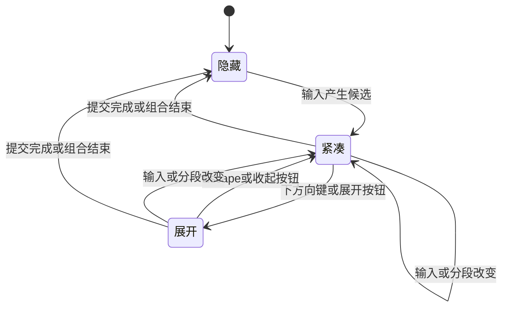

# macOS 原生风格卷轴候选：功能与交互方案

- 日期：2026-09-20
- 版本：1.1
- 状态：功能逻辑方案已形成；尚未开发或完成实机验收。
- 上位约束：[项目决策记录](decisions.md)。本文细化 D-06 和 D-11，覆盖屏幕卷轴与 Touch Bar 候选，不改变 Rime、全拼、独立仓库及现有中英文切换方向。

## 1. 目标与依据

输入时保持轻量，需要找词时展开更多候选，通过连续滚动快速浏览，看到哪个就能准确选择哪个。候选内容、顺序、组句和学习继续由 Rime 决定。

2026-09-20 新增正式需求：支持 Mac Touch Bar（触控栏），沿用原生风格的候选条浏览和点按选词。它与屏幕候选共享同一轮输入及选择结果，不另建候选或学习机制。

原生参照采用 Apple 的 macOS 26 中文输入说明。官方明确支持方向键浏览、上下滚动、数字选词、鼠标双击和空格确认，并提供按行移动的快捷键。本文据此设计卷轴体验。[Apple 候选窗口说明](https://support.apple.com/zh-cn/guide/chinese-input-method/cim12992/104/mac/26)

本文有两类结论：

- **资料事实**：有官方说明或参考源码支持，引用附在对应位置。
- **本项目约定**：官方未完整规定的展开键、收起规则、编号范围、尺寸和加载策略，本文直接给出实现默认值；不宣称这些细节已经逐项复刻系统输入法。

本机原生中文输入法已被用户关闭。本次曾尝试在临时 TextEdit 文稿观察候选窗，未取得有效结果，已经停止本机交互尝试；未重新启用中文输入法，也未修改输入法配置。以下不是实机观察报告，不以用户重新开启系统中文输入法为设计前提。

范围限于候选显示、浏览、选择及其引擎连接。不新增排序算法、联网热词、语法模型、通用输入法框架或重复词库。低频“前置单字 + 名词”分词问题继续仅记录，不进入本方案验收。

## 2. 窗口状态与完整操作流程

窗口只有隐藏、紧凑和展开三种呈现状态；加载提示属于窗口内容，不另设输入模式。

| 当前情形 / 操作 | 界面与文本结果 |
| --- | --- |
| 开始输入，Rime 返回候选 | 显示横向紧凑候选，当前候选高亮；不自动提交文字。 |
| 紧凑状态按下方向键或点展开按钮 | 展开为多行候选，保持当前候选及组合内容，补取更多候选。 |
| 在展开窗口滚轮或触控板滑动 | 连续移动视口，接近已加载末尾时继续加载；没有必须跨过的引擎页边界。 |
| 展开状态按 Escape 或点收起按钮 | 收起到包含当前高亮候选的紧凑行，保留当前拼音、选择和浏览位置。 |
| 同一轮候选再次展开 | 恢复此前位置，使当前高亮候选可见；不跳回首项。 |
| 输入字母、删除、移动拼音光标或引擎改变待转换分段 | 旧候选失效；重新显示紧凑候选，以引擎的新高亮为准，不沿用旧滚动位置。 |
| 确认一个候选后仍有待转换拼音 | 刷新剩余组合并显示其紧凑候选；不把局部确认误判为整句上屏。 |
| 全部提交、取消组合或切到英文 | 隐藏候选窗，清除该轮浏览状态。 |
| 输入仍在，但没有候选 | 保留组合文本；隐藏空候选窗。继续输入或删除后重新查询，不制造占位候选。 |
| 焦点切换到其他输入客户端 | 立即隐藏并使旧交互失效；文本收尾沿用系统接入层的组合处理，旧候选不得提交到新客户端。 |

状态示意：



## 3. 排布、定位与视觉反馈

以下是本项目的初始设计值，可在实现后根据实际可读性调整，不作为 Apple 原生尺寸的陈述。

- **紧凑窗口**：单行横排，最多显示 9 个候选；按文字宽度排布，空间不足时减少个数。末端保留展开按钮。
- **展开窗口**：从左到右、从上到下保持 Rime 顺序，多行排布并纵向滚动。每行最多 9 项，长词独占一行；超长词允许换行，不按字符拆成多个候选。已有行不会因追加新候选重新排布，正在补齐的末行除外。
- **默认尺寸**：候选字号 18 pt，展开宽度以 480 pt 为起点，最多约 6 个普通行；实际宽高受所在屏幕可用区域限制，宽度不超过其 80%，高度不超过其 35%。长句造成行高增加时减少可见行数。
- **定位**：跟随正在输入的光标，优先显示在其下方；下方空间不足时显示在上方，并限制在当前屏幕可见区域内。输入过程中追加候选不导致窗口反复上下跳动。
- **焦点**：窗口不成为文字输入焦点；点击、滚动和选词后，用户继续在原应用输入。
- **反馈**：明确区分选中高亮、鼠标悬停和数字标签。悬停仅提示，不改变待确认候选；高亮选中项保持可见。收起按钮与候选项有独立点击区域。
- **内容**：显示候选文字；方案返回的注释可用次要文字呈现。保留同字不同注释的候选，不按字符串去重。纯浏览不生成学习记录。
- **外观**：默认跟随系统明暗和高亮色，使用清晰的边界及选中效果。减少动态效果时关闭平滑动画，不影响滚动本身。

提供字体、字号、跟随系统/浅色/深色及效果预览即可；展开逻辑和编号规则不做一组复杂开关。预览使用示例候选，不读取个人学习词条。

## 4. 按键与鼠标规则

候选交互只在当前中文组合存在时接管相关按键。无组合时恢复原有英文、标点和应用快捷键行为。下表是本项目完整约定；方向键的具体分工及 Escape 两级处理属于产品设计。

| 操作 | 紧凑状态 | 展开状态 |
| --- | --- | --- |
| 普通字母、撇号、删除 | 交 Rime 处理一次，刷新候选 | 同左；候选变化后回到紧凑状态 |
| 下方向键 | 展开，保持当前高亮 | 移到下一显示行，选择水平位置最接近的一项；必要时滚动使其可见 |
| 上方向键 | 交当前 Rime 方案处理 | 移到上一显示行；已经在首行时保持，不隐式收起 |
| 左 / 右方向键 | 沿用 Rime 的组合光标编辑 | 按候选顺序移动一项，允许跨行；首尾不循环 |
| Escape | 取消当前尚未提交的组合；不删除已上屏文字 | 仅收起，不取消组合 |
| 空格 | 确认当前高亮候选 | 同左 |
| 数字 1–9 | 选择当前真实显示该标签的候选 | 选择当前操作行真实显示该标签的候选 |
| `-` / `=`，`[` / `]` | 展开并移到上一 / 下一显示行 | 移到上一 / 下一显示行 |
| Page Up / Page Down | 展开后移动一视口 | 移动一视口，尽可能保留一行重叠内容 |
| Return / Enter | 沿用 Rime 的原始输入确认路径，不由候选组件把它改成空格选词 | 同左；窗口样式不改变上屏语义 |
| Tab 与其他方案专用键 | 交当前 Rime 方案处理 | 同左；若输入或分段发生变化则刷新并收起 |
| Command 组合键及系统快捷键 | 保持既有系统接入层路由 | 同左，不因面板展开而吞掉复制、粘贴等操作 |
| 单击候选 | 仅移动高亮 | 同左 |
| 双击候选 | 通过 Rime 确认被点击项 | 同左；双击只执行一次候选确认 |
| 鼠标悬停 | 不移动高亮、不确认 | 同左 |
| 滚轮 / 触控板 | 展开并按手势滚动 | 连续滚动，支持系统自然滚动方向及惯性 |

展开时若要编辑拼音，先按 Escape 收起，再使用左右键；不额外创造一套光标编辑修饰键。方向移动至已知末尾时停留；尚未查到末尾则先加载，再完成该次移动，不循环回首项。

数字键没有对应可见标签时不选其他候选、不自动提交首项，也不把这个数字漏给宿主应用；保留组合。需要原样输入整段字母数字时，使用已有英文切换路径。Apple 提供的 Option + 数字输入方式可以作为以后独立的兼容增强，不在这轮改造中假定当前 Rime 已实现其语义。

纯拼音 `nihao` 的 Return 原样确认作为目标基线：提交 `nihao`，此次按键不再触发宿主应用的换行或发送。已有部分转换的组合仍采用引擎提交结果，不能由 UI 拼接猜测。Caps Lock 继续保留已接受的“原始拼音上屏后切换中英文”，长按大写锁定仍为独立可选增强。

Apple 对 Tab 的说明涉及部分输入法的候选整理方式，不能把它当作已核实的原生展开键。本项目保持 Rime 排序，不新增按部首、按声调筛选或排序菜单，也不显示无效入口。[Apple 候选操作说明](https://support.apple.com/zh-cn/guide/chinese-input-method/cim12992/104/mac/26)

### 4.1 Touch Bar（触控栏）功能规则

Touch Bar 是正式的候选交互入口。以系统候选条的外观、触摸和收展方式为参照，复用其字体、间距及可用区域，不另设计一套触控工具栏。以下为本项目功能契约，尚未实机比对全部原生细节。

| 场景 / 操作 | 处理规则 |
| --- | --- |
| 中文组合产生候选 | 在系统及应用允许显示候选条时提供当前 Rime 候选，顺序与屏幕一致；屏幕候选窗仍然保留。 |
| 触控栏横向浏览 | 按系统候选条交互浏览更多候选，按需复用候选缓存；只浏览不提交，也不单独学习。 |
| 点按某个候选 | 完成一次有效触摸选择后，通过全局索引交 Rime 确认一次；不要求双击，不在手指刚触下时提前上屏。 |
| 触摸过程中移到其他候选 | 如系统提供预选回调，同步当前预选高亮；屏幕显示同一候选，尚不提交文字。 |
| 触摸取消或最终没有选中项 | 不提交；若仍是同一轮候选，恢复触摸开始前的高亮。输入已变化则保留新状态，不恢复旧项。 |
| 屏幕上通过键盘或鼠标改变高亮 | 触控栏显示的当前选择同步更新，并在系统能力允许时将其带入可见范围。 |
| 输入、分段或方案变化 | 屏幕与触控栏均更新为同一候选代次；来自旧条目的延迟触摸无效。 |
| 点选后仍有未转换拼音 | 两处都显示剩余分段的候选，继续组句。 |
| 提交完成、取消、切到英文或切换应用 | 移除本次输入法候选，由系统恢复应用自身的触控栏；不得留下旧候选或抢占新应用。 |
| 用户收起触控栏候选区 | 尊重该收起操作；不取消拼音，也不强制收起屏幕窗口。屏幕卷轴的展开与收起同样不强迫触控栏跟随。 |
| 无触控栏、系统选择功能键、宿主不提供候选入口 | 屏幕及键盘选词正常；不弹缺少硬件的提示，不擅自改变系统触控栏设置。 |

屏幕与触控栏共享候选身份、顺序和实际选中项，各自的可见范围和滚动位置不要求逐像素同步。触控栏不显示屏幕的数字快捷键标签，不把屏幕上的“第 3 项”直接当作触控栏索引。

同一轮触摸以开始时实际呈现的候选身份为准。触摸期间追加或重排不能把手指下的条目替换成另一个候选；如组合已变则取消这次旧选择。两个界面的确认都进入第 6.4 节的同一链路，防止重复上屏与重复学习。

组合之外的英文预测、表情、音量、亮度、Control Strip、Touch ID 等保持系统或应用原有职责；不因“支持触控栏”扩展成整条触控栏管理工具。

## 5. 数字标签、高亮与滚动的一致性

编号采用“当前操作行”的局部编号，全局候选身份始终另外保存。

1. 紧凑状态对当前一行按从左到右显示 1–9。展开状态只对高亮所在行显示 1–9，其他行不显示可按的数字，避免同屏多组重复编号。
2. 方向键或单击移动高亮后，操作行随之改变。标签、选中效果与数字映射在同一界面更新中生效。
3. 纯滚动仍保留当前候选，直到它完全离开视口；此时将高亮移到首个完整可见行的第一项，若没有完整行则取首个可见项。同步更新引擎高亮，不提交、不学习。
4. 收起后展示当前高亮所在行，不跳回第一批候选；展开位置只对本轮组合有效。
5. 数字与鼠标事件绑定到最近实际呈现的布局版本。惯性滚动中按数字时停止惯性，选取用户看到的编号对应项；不得用下一帧、预取页或重排后的映射解释旧事件。
6. 所有路径最终解析到同一个 `(会话, 候选代次, 全局索引)`。例如窗口显示的“3”可能对应 Rime 全局索引 27；应选择 27，不能调用“当前引擎页第 3 项”。
7. 文本相同的两个候选仍有不同身份。任何选择都不通过候选字符串反查索引；旧窗口或旧客户端的延迟点击直接失效，不能兜底选择首项。

使用公共候选组件时，也必须满足上述可见标签与实际选择一致的契约；不能同时启用组件自带一套编号和外壳另一套编号。

## 6. Rime 与外壳的连接方式

### 6.1 保持现有职责

Rime 管理输入、分段、候选顺序、当前选择、提交和学习。外壳管理窗口状态、排布、滚动与可见标签，并把操作转换为引擎 API 调用。宿主应用只通过系统接入层收到引擎实际提交的文字。

参考鼠须管当前从 `RimeContext.menu` 取得一页候选，鼠标选择调用 `select_candidate_on_current_page`，滚轮最终调用 `change_page`。把每页数量调大仍不能形成这里定义的连续卷轴，需要替换这一页到窗口的映射方式。[Squirrel 输入控制器](https://github.com/rime/squirrel/blob/0cd71a6130a5866b0ae6ba0494929ebdc8211194/sources/SquirrelInputController.swift)、[候选面板](https://github.com/rime/squirrel/blob/0cd71a6130a5866b0ae6ba0494929ebdc8211194/sources/SquirrelPanel.swift)

### 6.2 按需取候选

采用 `candidate_list_from_index` 从全局索引读取候选，配合迭代器的 `next` / `end`；高亮用 `highlight_candidate`，确认用 `select_candidate`。引擎当前页大小不再等于界面一行或一屏大小。[librime API](https://github.com/rime/librime/blob/33e78140250125871856cdc5b42ddc6a5fcd3cd4/src/rime_api.h#L436)

- 初次只读足够绘制紧凑行的候选。展开后补到可见区域加约一屏预取；每批最多 32 项作为起点，实际以测量调整。
- 接近已加载末尾时串行补取。滚动视口连续，不显示“第几页”，不要求用户再按下一页才能继续。
- 不预先枚举全部候选、不臆造总数、不将首批 32 项或引擎一页作为全部结果。长列表按需继续读取，本轮已经取得的候选可缓存到组合改变为止。
- 拉取中保持已有内容可读，只在末端显示轻量加载状态；确认迭代结束才显示到底。会话失效或调用失败不能伪装成“没有更多”。
- 批次之间让出执行机会，优先处理新输入；单个引擎调用本身的耗时仍需测量，不能因分批便承诺无阻塞。

### 6.3 只维护必要状态

需要维护的是：当前输入客户端与 Rime 会话、候选代次、已复制的候选及全局索引、是否已到末尾、面板状态、滚动位置，以及当前已呈现的布局和标签映射。高亮以引擎状态为准；UI 保留的只是其显示快照，不另建持久选词状态或学习数据库。

输入、拼音光标、待转换分段、方案或会话变化时增加候选代次，使旧缓存、读取结果、布局事件失效。单纯移动高亮造成的引擎更新通知不自动等同于新一轮候选，否则每次浏览都会滚回开头。若高亮操作实际导致候选来源或分段改变，再按新一轮处理。

引擎访问由同一串行执行路径负责。每次短批读取期间不得穿插修改同一会话；复制文本和注释后及时结束迭代器，不跨异步等待保存迭代器。参考实现的迭代器持有当前菜单指针，文本缓冲也会在迭代中释放，不能当长期 UI 数据使用。[librime 迭代器实现](https://github.com/rime/librime/blob/33e78140250125871856cdc5b42ddc6a5fcd3cd4/src/rime_api_impl.h#L373)

高亮调用产生的通知在当前引擎调用结束后统一处理，避免递归更新。`highlight_candidate` 返回 false 可能只是位置没有变化，不能据此强制选择首项。[Context 高亮实现](https://github.com/rime/librime/blob/33e78140250125871856cdc5b42ddc6a5fcd3cd4/src/rime/context.cc#L132)

### 6.4 统一确认链路

```text
可见候选事件
  → 核对客户端、会话、候选代次及已呈现布局
  → 解析全局候选索引
  → Rime select_candidate（仅一次）
  → 取出并消费引擎 commit（有则上屏，仅一次）
  → 重新获取 context
  → 仍有组合：更新预编辑文本与紧凑候选；否则隐藏
```

`select_candidate` 成功不等于整句已经提交，可能只选定当前分段。禁止直接把候选文字交给客户端插入；也禁止在选择后再模拟空格，造成二次确认或重复学习。[Context 选择实现](https://github.com/rime/librime/blob/33e78140250125871856cdc5b42ddc6a5fcd3cd4/src/rime/context.cc#L118)

## 7. 窗口实现：先用公开组件验证，必要时只换视图

Apple 的公开 `IMKCandidates` 提供候选窗口、选择回调及显示控制。当前 SDK 还声明了单行和滚动网格等面板类型，因此应先验证能否直接承载上述交互，避免从零重复建设系统已有能力。[Apple IMKCandidates](https://developer.apple.com/documentation/inputmethodkit/imkcandidates)、[面板类型](https://developer.apple.com/documentation/inputmethodkit/imkcandidatepaneltype)

本次静态依据包括本机 SDK 的 `InputMethodKit.framework/Headers/IMKCandidates.h` 与 `IMKInputController.h`。头文件描述的滚动网格为 5 列，不能据此断言它就是当前系统拼音的全部界面实现。公开组件的存在也不能证明自动拥有无限加载和本方案的编号方式。

先做一个局限于候选窗的集成验证，采用同一组固定候选和实际 Rime 会话核对以下条件：

| 条件 | 必须满足的结果 |
| --- | --- |
| 紧凑与展开切换 | 使用公开面板类型切换，保留选择；能恢复同一轮浏览位置 |
| 增量候选 | 追加候选不跳回顶部，能获知何时需要下一批；不依赖完整枚举 |
| 编号与身份 | 可见数字准确对应候选；相同文字的不同候选可稳定区分 |
| 导航与鼠标 | 能实现本方案的高亮、收起及单击/双击语义；不抢宿主输入焦点 |
| 按键路由 | 外壳能先处理 Return、Escape、数字等；一次事件只产生一次动作 |
| 外观与可访问性 | 能达到字体、明暗、长词阅读、键盘操作和辅助功能的基本要求 |
| Touch Bar 接入 | 在真实宿主输入会话中显示同源候选，触摸选择回到统一确认链路；屏幕窗口方案不能破坏此能力 |

实现时特别注意：

- `candidateSelectionChanged` 仅用于高亮，`candidateSelected` 才进入确认链路；不能把移动高亮当选词。
- 使用组件候选标识到 Rime 全局索引的明确映射，不能把网格行号当候选索引。若不能可靠取得或维持该映射，就不采用此组件。
- 候选窗口应通过公开的事件路由选项让输入控制器先处理必要按键。仅设置“不自动关闭窗口”仍可能触发 Return 选词，不能替代按键拦截。
- 头文件没有保证追加数据后保持像素滚动位置，也没有在本次静态核对中发现通用的“接近末尾”通知；这些属于需要验证的能力，不能在实现计划中默认成立。

若任一核心条件无法通过，候选窗口使用 **AppKit 非激活 NSPanel + NSScrollView + 候选内容视图**，保留相同的输入接入和 Rime 调用逻辑。原生组件的固定列数若无法满足长词排布，也走这一处理。新增视图的必要性仅是公开组件不能满足已经明确的体验。

最终保留一种窗口实现，不长期维护两套渲染器或建设插件接口。鼠须管用于借鉴会话、预编辑、上屏及定位；Fcitx5 的全局候选适配可继续参考，不因此引入完整 Fcitx5 框架或默认使用 WebView。

### 7.1 Touch Bar 的系统接入边界

已核实的公开能力：AppKit 提供 `NSCandidateListTouchBarItem`，支持候选显示及触摸选择回调；其 `allowsTextInputContextCandidates` 属性允许使用文本输入系统的候选。[Apple 候选条接口](https://developer.apple.com/documentation/appkit/nscandidatelisttouchbaritem)、[文本输入候选开关](https://developer.apple.com/documentation/appkit/nscandidatelisttouchbaritem/allowstextinputcontextcandidates)

本机 SDK 的 `NSCandidateListTouchBarItem.h` 进一步说明：`NSTextInputContext` 使用当前视图的候选条显示输入法候选；触摸结束回调中的 `NSNotFound` 表示未选择。该组件属于宿主文本视图所在的应用，不能直接等同于输入法服务自身的控件。[Apple 视图候选条接口](https://developer.apple.com/documentation/appkit/nsview/candidatelisttouchbaritem)

因此实现顺序是：

1. 在验证 `IMKCandidates` 时，一并验证输入法候选通过系统输入上下文进入宿主 Touch Bar、再回到输入法的完整路径。公开组件证明存在系统支持点，不证明任意自绘输入法已经接通该路径。
2. 以全局索引和候选代次完成映射。宿主 Touch Bar 的条目位置或回调索引不得直接作为 Rime 索引；宿主默认的文字替换也不能与引擎确认同时执行。若系统已将选择路由到 IMK 回调，不再额外接一条确认路径。
3. 如果屏幕卷轴采用自研 AppKit 视图，验证其能否与系统候选发布机制共用数据、避免出现第二个屏幕候选窗，并继续保持 Touch Bar 可用；不能假定 `NSPanel` 自然附带此能力。
4. 跨应用接入尚未验证通过前，不确定其具体桥接 API，也不以在设置应用中显示一个 `NSTouchBar` 演示替代验证。系统决定前台触控栏的组合与显示，输入法创建自己的普通触控栏不能据此控制其他应用。[Apple NSTouchBar 架构说明](https://developer.apple.com/documentation/appkit/nstouchbar)

参考鼠须管快照的 `sources` 中未检索到显式 Touch Bar 接入代码；这只是源码检查结果，不足以断言其运行时一定不支持系统候选桥接。本轮只读核对源码、SDK 和官方文档，未启动模拟器、查看用户触控栏或操作输入法。

Touch Bar 支持纳入候选窗口技术选型条件；不能先宣告自绘方案完成，再把触控栏作为可忽略的附加项。若公开接入无法满足要求，应记录具体失败的系统版本和宿主场景，重新评估桥接方式；不默认加入私有 API、全局触控栏接管或额外常驻程序。

## 8. 异常、兼容与可访问性

- **正在加载又继续输入**：优先新输入，旧结果作废；不闪现上轮候选。
- **读取失败**：保留可验证仍属当前代次的已加载内容，停止继续预取；会话失效则隐藏。错误送诊断记录，不在用户每次打字时弹对话框，也不清空学习数据。
- **窗口缩放、字号或屏幕变化**：重新排布并保留当前候选锚点；发布新布局及编号，旧布局事件失效。
- **应用焦点变化**：旧窗口立即隐藏，拖延到达的鼠标及按键回调不能写入新应用。组合结束时的提交或清除沿用既有系统接入规则。
- **屏幕边缘与多屏**：按当前输入点所在屏幕定位，处理负坐标、缩放及显示器移除；不能固定按主屏尺寸计算。
- **辅助功能**：候选提供文字、注释、选中状态和确认动作；键盘可以完成全部浏览与选择。加载更多不逐条强制播报，焦点不能离开实际输入客户端。

## 9. 实施顺序与验收清单

整体任务顺序、设置与词库范围、阶段依赖和估算见[实施计划](implementation-plan.md)。本节保留候选与 Touch Bar 的功能验收条件。

实施按三个小步骤推进：先同时验证公共候选组件与 Touch Bar 跨应用接入，并选定一种屏幕窗口实现；再接通 Rime 的全局候选读取和统一选择链路；最后完成定位、样式、设置预览及真实应用兼容。当前交付是功能方案，不代表已获授权安装或切换用户输入法。

| 场景 | 验收结果 |
| --- | --- |
| 输入全拼后展开、收起、再展开 | 拼音没有丢失或上屏；同一轮保留当前候选与浏览位置 |
| 候选超过两个引擎页 | 可连续滚到后续结果；视口不随引擎翻页整块替换 |
| 中间位置按数字、空格及鼠标双击 | 都选择实际看到的对应全局候选；没有当前页索引错位 |
| 快速滑动中按数字 | 按最近呈现的标签选择，停止惯性，不选下一帧对应项 |
| 两个候选文字相同但注释不同 | 身份保留，确认结果对应被操作的那一项 |
| 只移动高亮、单击和纯滚动 | 无候选提交、无重复确认；纯浏览不作为学习样本 |
| 选词后仍有剩余拼音 | 正确继续组句，局部选择不被当作完整提交 |
| 加载中输入新字母、删除或移动拼音光标 | 旧候选及旧点击失效，新结果正常出现 |
| 追加候选和通知回调 | 不重复加载、不递归刷新、不意外滚回首项 |
| 纯拼音 Return 及 Caps Lock 切换 | 原字母只上屏一次；Return 不误提交汉字或发送消息；模式切换符合基线 |
| 当前无候选或已到末尾 | 不崩溃、不制造候选、不无限加载，也不误删组合 |
| 应用切换、多屏、屏幕边缘及不同缩放 | 窗口位置正确，不抢焦点，不把旧候选提交到其他客户端 |
| 长候选、字号变化、明暗与辅助功能 | 可读、可操作，重排后数字映射仍一致 |
| Touch Bar 点按候选及取消触摸 | 有效点按只确认一次；触下和取消均不提前上屏，不绕过 Rime 学习 |
| 两处交替浏览、高亮、选词 | 同源候选及选择结果一致，索引不串位；各自收起不取消组合 |
| 触摸中输入变化、切换应用或追加候选 | 不选中旧候选，不将手指下条目悄悄替换，不提交到其他客户端 |
| 组合结束与系统触控栏模式切换 | 正确撤下输入法候选，应用和系统控件恢复；无触控栏时普通输入不受影响 |

自动化检查应聚焦候选代次、索引映射、局部确认和重复提交等逻辑。真实应用验收覆盖 TextEdit、浏览器输入框，以及终端和常用编辑器；确认输入接入与窗口行为后再扩大范围。本轮未运行这些检查，也未对用户当前输入法进行运行验收。

Touch Bar 必须在具备实体触控栏的 Mac 上完成点按、滑动、取消和跨应用验收，模拟器只作开发辅助。记录系统版本、应用版本及系统触控栏模式；区分宿主本来没有候选入口和新输入法接入失败，不能仅以一个应用显示成功推断所有应用可用。当前未核实用户硬件，也未要求其开启原生中文输入法。

## 10. 版本与可追溯性

本方案引用的参考快照：Squirrel `0cd71a6130a5866b0ae6ba0494929ebdc8211194`，librime `33e78140250125871856cdc5b42ddc6a5fcd3cd4`。这是源码依据，不代表新项目已固定依赖版本。

| 版本 | 日期 | 变更 |
| --- | --- | --- |
| 1.0 | 2026-09-20 | 补齐窗口状态、连续滚动、编号与选择、按键、Rime 接入、组件选用及验收规则；区分官方事实与本项目约定。仅文档交付，未修改用户输入法配置。 |
| 1.1 | 2026-09-20 | 纳入正式 Touch Bar 支持：候选条交互、双界面同步、触摸确认及取消、系统与宿主接入边界，并加入技术选型和实体验收条件。仅更新方案，未进行本机输入交互。 |
